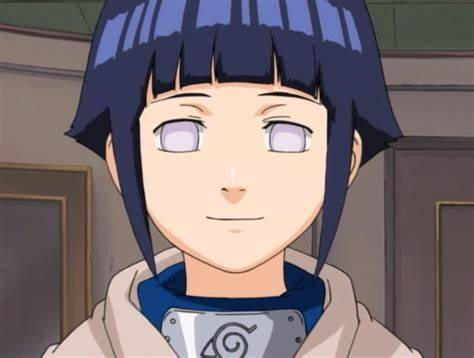

[Regresar a la página principal](../README.md)

# Hinata Hyuga

Hinata Hyūga es un personaje destacado en el universo de "Naruto", creado por Masashi Kishimoto. Como miembro del prestigioso Clan Hyūga y poseedora del Byakugan, Hinata tiene un papel importante en la serie tanto en términos de su desarrollo personal como en su relación con otros personajes, especialmente Naruto Uzumaki.

## Índice de Contenidos

1. [Primeros Años y Origen](#primeros-años-y-origen).
2. [Infancia y Entrenamiento](#infancia-y-entrenamiento).
3. [Influencia de Naruto Uzumaki](#influencia-de-naruto-uzumaki).
4. [Desarrollo Personal y Participación en Batallas](#desarrollo-personal-y-participación-en-batallas).
   - [Exámenes Chūnin](#exámenes-chūnin).
   - [Arco de Pain](#arco-de-pain).
5. [Relación con Naruto](#relación-con-naruto).
   - [Confesión y Matrimonio](#confesión-y-matrimonio).
6. [Habilidades y Técnicas](#habilidades-y-técnicas).
    - [Paso Suave Puños Gemelos de León (Jūho Sōshiken)](#paso-suave-puños-gemelos-de-león-jūho-sōshiken).
7. [Hinata como Madre y Líder](#hinata-como-madre-y-líder).
8. [Conclusión](#conclusión).

### Primeros Años y Origen

Hinata nació como la hija mayor del líder del Clan Hyūga, Hiashi Hyūga. Desde pequeña, estaba destinada a ser la heredera del clan. Sin embargo, su naturaleza tímida y su falta de agresividad hicieron que su padre y otros miembros del clan la consideraran débil y no apta para el liderazgo. Esto resultó en que su hermana menor, Hanabi, fuera vista como una mejor candidata para liderar el clan.

[Regresar al inicio ☝🏻](#hinata-hyuga)

#### Infancia y Entrenamiento

A pesar de sus dificultades, Hinata continuó entrenando diligentemente bajo la estricta supervisión de su padre y otros miembros del clan. Su timidez y su naturaleza gentil hicieron que le fuera difícil cumplir con las expectativas de su clan, lo que llevó a una disminución en su confianza en sí misma. Aun así, Hinata mostró una gran determinación y deseo de mejorar, especialmente después de conocer a Naruto Uzumaki.

[Regresar al inicio ☝🏻](#hinata-hyuga)

### Influencia de Naruto Uzumaki

Naruto tuvo un impacto significativo en la vida de Hinata desde una edad temprana. A pesar de ser despreciado y subestimado por casi todos en la aldea, Naruto nunca se rindió y siempre se esforzó por alcanzar sus sueños. La actitud valiente y positiva de Naruto inspiró a Hinata a esforzarse más y a creer en sí misma. Desarrolló un profundo afecto por Naruto, que más tarde se convirtió en amor.

[Regresar al inicio ☝🏻](#hinata-hyuga)

### Desarrollo Personal y Participación en Batallas

A lo largo de la serie, Hinata crece tanto en fuerza como en confianza. Su evolución se ve reflejada en varias batallas clave:

#### Exámenes Chūnin

Durante los Exámenes Chūnin, Hinata muestra su determinación y habilidades en su combate contra Neji Hyūga, su primo. Aunque es derrotada, su valiente esfuerzo y su decisión de no rendirse impresionan a Naruto y otros espectadores. Este combate marca un punto de inflexión en su desarrollo, demostrando que tiene la capacidad de superar sus propios límites.

#### Arco de Pain

Uno de los momentos más significativos para Hinata es su enfrentamiento con Pain durante su ataque a Konoha. A pesar de saber que es significativamente más débil que Pain, Hinata se enfrenta a él con valentía para proteger a Naruto. Esta acción es un testimonio de su amor y dedicación hacia Naruto, así como de su crecimiento personal. Aunque es derrotada y gravemente herida, su intervención motiva a Naruto a liberar su poder para derrotar a Pain.

[Regresar al inicio ☝🏻](#hinata-hyuga)

### Relación con Naruto

La relación de Hinata con Naruto es uno de los pilares de su desarrollo como personaje. Desde su amor no correspondido y tímido hasta su eventual matrimonio, su relación con Naruto evoluciona de manera significativa. Hinata siempre ha admirado a Naruto por su perseverancia y bondad, y Naruto, a su vez, llega a apreciar y corresponder los sentimientos de Hinata.

#### Confesión y Matrimonio

La confesión de Hinata durante la batalla contra Pain es un momento crucial en su relación. Aunque Naruto no puede responder a sus sentimientos de inmediato, este acto de valentía solidifica la importancia de Hinata en su vida. Eventualmente, Naruto llega a comprender y corresponder los sentimientos de Hinata. En "The Last: Naruto the Movie", se muestra cómo su relación se desarrolla y florece, culminando en su matrimonio y la formación de una familia.

[Regresar al inicio ☝🏻](#hinata-hyuga)

### Habilidades y Técnicas

Como miembro del Clan Hyūga, Hinata posee el Byakugan, que le otorga habilidades visuales únicas propias del Byakugan. Además, ha dominado varias técnicas del clan y ha desarrollado algunas propias como el:

 **Paso Suave Puños Gemelos de León (Jūho Sōshiken)**:
   - **Descripción**: Una técnica desarrollada por Hinata, que forma leones gemelos de chakra en sus manos, aumentando el poder destructivo de sus ataques.

[Regresar al inicio ☝🏻](#hinata-hyuga
)
### Hinata como Madre y Líder

En "Boruto: Naruto Next Generations", Hinata se convierte en la madre de Boruto Uzumaki y Himawari Uzumaki. Su papel como madre y esposa de Naruto, ahora el Séptimo Hokage, destaca su madurez y su crecimiento como persona. A pesar de su naturaleza gentil, Hinata sigue siendo una figura fuerte y protectora para su familia, demostrando que ha mantenido y fortalecido su espíritu de lucha y amor.

[Regresar al inicio ☝🏻](#hinata-hyuga)

### Conclusión

Hinata Hyūga es un personaje que ejemplifica la evolución y el crecimiento personal a través de la perseverancia y el amor. Desde sus primeros días de timidez e inseguridad hasta convertirse en una kunoichi fuerte, una esposa amorosa y una madre dedicada, Hinata demuestra que la verdadera fuerza proviene del corazón y del deseo de proteger a los seres queridos. Su viaje en "Naruto" y "Boruto" es un testimonio del poder de la autoaceptación y la importancia de tener un propósito y una conexión con los demás.

[Regresar al inicio ☝🏻](#hinata-hyuga)