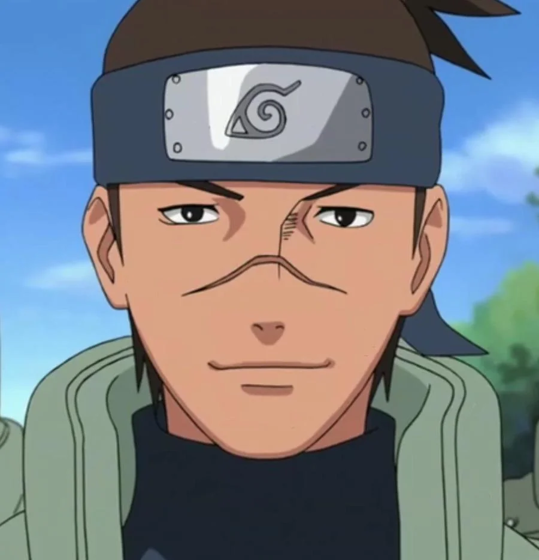

[Regresar a la página principal](../README.md)

# Iruka Umino

Iruka Umino es un personaje recurrente y significativo en la serie "Naruto", creado por Masashi Kishimoto. Como uno de los primeros mentores y figuras paternas de Naruto Uzumaki, Iruka desempeña un papel fundamental en el desarrollo del protagonista principal y en la exploración de temas como la soledad, la redención y el poder del afecto y la amistad. A lo largo de la serie, Iruka evoluciona de ser un maestro de la Academia Ninja a un shinobi respetado y un símbolo de apoyo y guía para Naruto y otros jóvenes ninjas.

## Índice de Contenidos

1. [Orígenes y Personalidad](#orígenes-y-personalidad).
2. [Pérdida y Determinación](#pérdida-y-determinación).
3. [Papel en la Academia Ninja](#papel-en-la-academia-ninja).
4. [Conexión con Naruto](#conexión-con-naruto).
5. [Contribuciones en Momentos Clave](#contribuciones-en-momentos-clave).
6. [Desarrollo Personal y Redención](#desarrollo-personal-y-redención).
7. [Legado y Significado](#legado-y-significado).

### Orígenes y Personalidad

Iruka nació y creció en Konohagakure, la Aldea Oculta de la Hoja, y asistió a la Academia Ninja como estudiante antes de convertirse en maestro. Desde una edad temprana, Iruka demostró una naturaleza compasiva y un deseo de ayudar a otros, lo que lo llevó a buscar una carrera como educador en la Academia Ninja.

[Regresar al inicio ☝🏻](#iruka-umino)

#### Pérdida y Determinación

El origen de la conexión entre Iruka y Naruto se remonta a la infancia del último, cuando Naruto era un niño marginado y solitario debido a su estatus como Jinchūriki del Nueve Colas. Como superviviente del ataque de Kurama, que resultó en la muerte de sus padres, Iruka entendió el dolor y la soledad de Naruto mejor que la mayoría. A pesar de sus propias cicatrices emocionales, Iruka decidió convertirse en una figura de apoyo y mentor para Naruto, actuando como una figura paterna sustituta para el joven ninja.

[Regresar al inicio ☝🏻](#iruka-umino)

### Papel en la Academia Ninja

#### Maestro en la Academia

Uno de los aspectos más destacados del papel de Iruka en la serie es su función como maestro en la Academia Ninja. Como instructor, Iruka enseña a las nuevas generaciones de ninjas los fundamentos del ninjutsu, el taijutsu y el genjutsu, y actúa como una figura de autoridad y orientación para los estudiantes.

#### Conexión con Naruto

La conexión entre Iruka y Naruto es un tema recurrente a lo largo de la serie. A pesar de las dificultades iniciales y la actitud desafiante de Naruto, Iruka siempre se preocupa por el bienestar de su estudiante y está dispuesto a apoyarlo en los momentos difíciles. A través de su relación, Iruka no solo actúa como un mentor para Naruto, sino también como una figura de inspiración y afecto que influye en el desarrollo y la maduración del joven ninja.

[Regresar al inicio ☝🏻](#iruka-umino)

### Contribuciones en Momentos Clave

#### Exámenes Chūnin

Durante los Exámenes Chūnin, Iruka se encuentra en una posición única para comprender y apoyar a Naruto, quien está luchando por ganarse el reconocimiento de los demás y demostrar su valía como ninja. A través de sus palabras de aliento y su ejemplo de determinación, Iruka ayuda a Naruto a superar sus dudas y a encontrar la fuerza interior para enfrentar los desafíos por delante.

#### Batalla contra Pain

Uno de los momentos más conmovedores en la serie es cuando Iruka se enfrenta valientemente a Pain para proteger a Naruto durante el ataque a Konoha. A pesar del abrumador poder del enemigo, Iruka muestra una firme determinación y coraje, dispuesto a sacrificar su propia vida por el bienestar de su estudiante. Esta acción no solo demuestra el vínculo profundo entre Iruka y Naruto, sino también el profundo impacto que Iruka ha tenido en la vida de Naruto y en su desarrollo como persona.

[Regresar al inicio ☝🏻](#iruka-umino)
### Desarrollo Personal y Redención

#### Superación del Pasado

A lo largo de la serie, se revelan detalles sobre el pasado de Iruka y su relación con Naruto, incluyendo su conexión con los padres de Naruto y su papel en la vida del joven ninja. A medida que la serie avanza, Iruka también enfrenta sus propios desafíos personales y emocionales, incluida la superación de su dolor por la pérdida de sus padres y su determinación de convertirse en un modelo a seguir positivo para los jóvenes ninjas de Konoha.

#### Redención y Aceptación

Uno de los temas centrales en la historia de Iruka es su viaje hacia la redención y la aceptación de su pasado. A medida que Iruka se enfrenta a sus propios demonios internos y supera las dificultades en su vida, encuentra la fuerza para perdonarse a sí mismo y aceptar su papel como maestro y mentor para los jóvenes ninjas de Konoha. Este proceso de crecimiento y desarrollo personal es una parte integral de la historia de Iruka y su evolución como personaje a lo largo de la serie.

[Regresar al inicio ☝🏻](#iruka-umino)

### Legado y Significado

En última instancia, Iruka es más que un maestro en la Academia Ninja; es una figura de inspiración y guía que representa los valores de la amistad, el sacrificio y la redención. Su relación con Naruto no solo ilustra el poder del afecto y el apoyo mutuo, sino también la importancia de tener una figura de autoridad positiva y comprensiva en la vida de un joven. A lo largo de la serie, Iruka demuestra que incluso las personas comunes pueden tener un impacto extraordinario en la vida de los demás y dejar un legado duradero en el mundo que los rodea.

[Regresar al inicio ☝🏻](#iruka-umino)