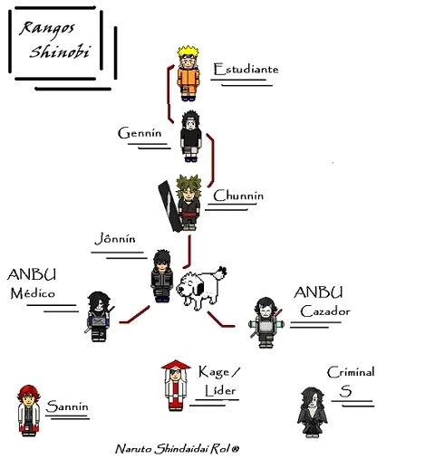

[Regresar a la página principal](../README.md)

# Rangos

En el mundo shinobi, los rangos y jerarquías juegan un papel crucial en la estructura y organización de las aldeas ninja. Estos sistemas de clasificación determinan la autoridad, responsabilidad y prestigio de los ninjas dentro de sus respectivas comunidades.

## Indice de Contenidos

1. [Rangos Básicos](#rangos-básicos).
    - [Genin](#genin).
    - [Chunin](#chunin).
    - [Jonin](#jonin).
2. [Rangos Especiales](#rangos-especiales).
    - [Anbu](#anbu).
    - [Kage](#kage).
3. [Roles y Tareas](#roles-y-tareas).
    - [Misiones](#misiones).
    - [Entrenamiento y Desarrollo](#entrenamiento-y-desarrollo).
    - [Protección y Defensa](#protección-y-defensa).
    - [Diplomacia y Relaciones Exteriores](#diplomacia-y-relaciones-exteriores).
4. [Ascenso de Rangos](#ascenso-de-rangos).
    - [Genin a Chunin](#genin-a-chunin).
    - [Chunin a Jonin](#chunin-a-jonin).
    - [Otros Ascensos](#otros-ascensos).
5. [Méritos y Logros](#méritos-y-logros).
6. [Conclusión](#conclusión).

### Rangos Básicos

#### Genin

Los Genin son los ninjas más básicos y recién graduados de la academia ninja. Su principal tarea es realizar misiones de bajo riesgo, como tareas de escolta, recolección de información o patrullaje. Los Genin suelen trabajar en equipos bajo la supervisión de un Jonin.

#### Chunin

Los Chunin son ninjas de rango medio que han demostrado habilidades excepcionales y liderazgo. Son responsables de liderar equipos de Genin en misiones más desafiantes y actúan como enlaces entre los líderes de la aldea y los ninjas de rango inferior.

#### Jonin

Los Jonin son ninjas de élite y expertos en su campo. Pueden liderar equipos de Chunin y Genin en misiones de alto riesgo, como infiltración, asesinato o combate directo. Algunos Jonin también tienen roles de enseñanza en la academia ninja o como mentores de ninjas más jóvenes.

[Regresar al inicio 驕뢣릞즇(#rangos)

### Rangos Especiales

#### Anbu

Los Anbu son una unidad de élite de ninjas de élite que realizan misiones especiales para proteger la aldea y realizar operaciones encubiertas. Operan en secreto y usan máscaras para ocultar su identidad. Los Anbu son seleccionados entre los Jonin más hábiles y experimentados.

#### Kage

El Kage es el líder supremo de una aldea ninja y tiene autoridad sobre todos los asuntos políticos, militares y civiles. Los Kage son ninjas extremadamente poderosos y respetados, generalmente seleccionados entre los Jonin más destacados de la aldea. Cada aldea tiene un Kage, como el Hokage de Konoha o el Kazekage de la Aldea Oculta de la Arena.

[Regresar al inicio 驕뢣릞즇(#rangos)

### Roles y Tareas

#### Misiones

Los ninjas de todos los rangos son asignados a misiones por sus superiores. Estas misiones pueden variar desde tareas simples de recolección hasta operaciones de alto riesgo, dependiendo del rango y habilidades del ninja. Las misiones se clasifican en diferentes niveles de dificultad, desde D (más fácil) hasta S (más difícil).

#### Entrenamiento y Desarrollo

Los ninjas de rango superior, como los Jonin y los Kage, tienen la responsabilidad de entrenar y desarrollar a los ninjas más jóvenes. Esto puede incluir enseñar habilidades de combate, tácticas de supervivencia, técnicas ninja avanzadas y transmitir los valores y tradiciones de la aldea.

#### Protección y Defensa

Los ninjas tienen la responsabilidad de proteger su aldea y a sus habitantes de amenazas internas y externas. Esto puede incluir defender la aldea de ataques de enemigos, mantener la seguridad en las fronteras y realizar operaciones de inteligencia para recopilar información sobre posibles amenazas.

#### Diplomacia y Relaciones Exteriores

Los líderes de las aldeas, como los Kage, a menudo tienen que manejar relaciones diplomáticas con otras aldeas ninja y países vecinos. Esto puede implicar negociar tratados de paz, alianzas militares o resolver disputas territoriales para mantener la estabilidad en la región.

[Regresar al inicio 驕뢣릞즇(#rangos)

### Ascenso de Rangos

#### Genin a Chunin

Para ascender de Genin a Chunin, los ninjas deben participar en los Exámenes Chūnin, una serie de pruebas diseñadas para evaluar sus habilidades de combate, estrategia y trabajo en equipo. Estos exámenes pueden incluir pruebas escritas, batallas uno a uno y misiones simuladas. Aquellos que demuestren un desempeño excepcional y una comprensión de los principios ninja son promovidos al rango de Chunin.

#### Chunin a Jonin

El ascenso de Chunin a Jonin generalmente no está determinado por exámenes formales, sino por el reconocimiento de sus habilidades y liderazgo por parte de los superiores. Los Chunin que demuestran un dominio excepcional en el combate, liderazgo y estrategia, así como un profundo conocimiento de las técnicas ninja, pueden ser recomendados por sus superiores para ascender al rango de Jonin.

#### Otros Ascensos

Para ascender a rangos especiales como Anbu o Kage, los ninjas deben ser seleccionados o nominados por los líderes de la aldea. Estos ascensos generalmente están reservados para aquellos que han demostrado un nivel extremadamente alto de habilidad, lealtad y dedicación a la aldea. Los candidatos son evaluados en función de su historial de misiones, habilidades de combate y liderazgo, así como su capacidad para manejar responsabilidades adicionales y situaciones de alto riesgo.

[Regresar al inicio 驕뢣릞즇(#rangos)

### Méritos y Logros

En todos los casos, el ascenso de rango está basado en los méritos y logros del ninja. Aquellos que demuestran un desempeño excepcional en misiones, muestran habilidades sobresalientes en combate y estrategia, y muestran un compromiso inquebrantable con los principios ninja y la protección de su aldea, tienen más probabilidades de ser considerados para ascensos de rango.

[Regresar al inicio 驕뢣릞즇(#rangos)

### Conclusión

En resumen, los rangos y jerarquías en el mundo shinobi son fundamentales para la organización y funcionamiento de las aldeas ninja. Desde los Genin recién graduados hasta los poderosos Kage, cada ninja tiene un papel vital que desempeñar en la protección y prosperidad de su aldea. Ya sea realizando misiones, entrenando a la próxima generación de ninjas o defendiendo su hogar de amenazas externas, los ninjas trabajan juntos para mantener el equilibrio y la paz en el mundo ninja.

[Regresar al inicio 驕뢣릞즇(#rangos)
