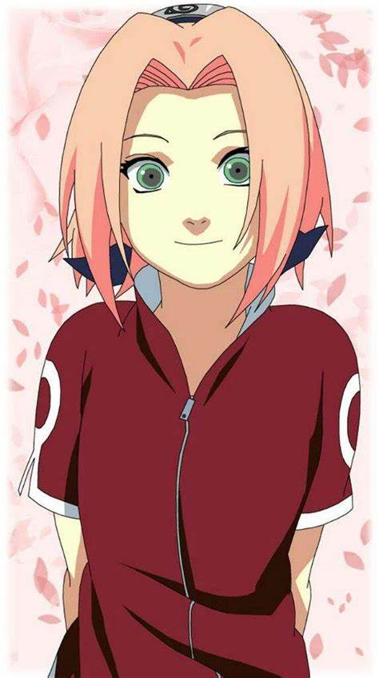

[Regresar a la página principal](../README.md)

# Sakura Haruno

Sakura Haruno es un personaje principal en la serie "Naruto", creado por Masashi Kishimoto. A lo largo de la serie, Sakura experimenta un notable crecimiento personal y habilidades como ninja, pasando de ser una niña insegura a una kunoichi poderosa y determinada. Su historia está marcada por el desarrollo de sus habilidades ninja, sus relaciones con otros personajes y su búsqueda de significado y propósito en el mundo ninja.

## Índice de Contenidos

1. [Orígenes y Personalidad](#orígenes-y-personalidad).
2. [Relaciones con Naruto y Sasuke](#relaciones-con-naruto-y-sasuke).
3. [Desarrollo Ninja](#desarrollo-ninja).
    - [Entrenamiento con Tsunade](#entrenamiento-con-tsunade).
    - [Superación de Obstáculos](#superación-de-obstáculos).
4. [Relación con Sasuke](#relación-con-sasuke).
    - [Rescate y Confesión](#rescate-y-confesión).
5. [Contribuciones y Habilidades](#contribuciones-y-habilidades).
    - [Ninjutsu Médico](#ninjutsu-médico).
    - [Fuerza Física y Taijutsu](#fuerza-física-y-taijutsu).
6. [Madurez y Liderazgo](#madurez-y-liderazgo).
7. [Maternidad y Familia](#maternidad-y-familia).
8. [Conclusión](#conclusión).

### Orígenes y Personalidad

Sakura nació en Konohagakure y creció como una niña ordinaria en la aldea. Desde una edad temprana, Sakura demostró ser una estudiante dedicada y trabajadora, aunque a menudo se mostraba tímida e insegura. A pesar de sus dudas sobre sí misma, Sakura poseía una inteligencia aguda y una gran capacidad de aprendizaje, lo que la llevó a sobresalir en la Academia Ninja.

[Regresar al inicio ☝🏻](#sakura-haruno)

### Relaciones con Naruto y Sasuke

Sakura es conocida por su relación con Naruto Uzumaki y Sasuke Uchiha, sus compañeros de equipo en el Equipo 7. Desde el principio, Sakura desarrolló sentimientos románticos por Sasuke, mientras que su relación con Naruto era más complicada, fluctuando entre la amistad y la frustración debido a las actitudes impulsivas de Naruto y la incapacidad de Sakura para comprender completamente su dolor y soledad.

[Regresar al inicio ☝🏻](#sakura-haruno)

### Desarrollo Ninja

#### Entrenamiento con Tsunade

Uno de los momentos más significativos en la vida de Sakura fue su entrenamiento con Tsunade, la Quinta Hokage de Konoha y una legendaria kunoichi conocida como la "Sannin Tsunade". Bajo la tutela de Tsunade, Sakura desarrolló sus habilidades médicas y ninjas, convirtiéndose en una maestra en el arte del Taijutsu y la Ninjutsu Médico.

#### Superación de Obstáculos

A lo largo de la serie, Sakura enfrentó numerosos desafíos y obstáculos que pusieron a prueba su fuerza y determinación. Desde batallas con enemigos formidables hasta crisis emocionales, Sakura demostró una notable capacidad para adaptarse y crecer a partir de sus experiencias, fortaleciendo su resolución y habilidades en el proceso.

[Regresar al inicio ☝🏻](#sakura-haruno)

### Relación con Sasuke

La relación de Sakura con Sasuke es un aspecto central de su desarrollo como personaje. Desde el principio, Sakura se sintió atraída por Sasuke debido a su apariencia y su habilidad como ninja. Sin embargo, a medida que la serie avanza, Sakura llega a comprender más profundamente a Sasuke y su doloroso pasado, lo que la lleva a desarrollar un deseo genuino de ayudarlo y apoyarlo en su búsqueda de redención.

#### Rescate y Confesión

Uno de los momentos más destacados en la relación de Sakura y Sasuke fue durante el arco de la "Búsqueda de Sasuke", cuando Sakura arriesgó su vida para tratar de detener a Sasuke de seguir un camino de venganza autodestructivo. Su confesión de amor a Sasuke durante esta confrontación fue un testimonio de su crecimiento como personaje y su determinación de estar a su lado, incluso en sus momentos más oscuros.

[Regresar al inicio ☝🏻](#sakura-haruno)

### Contribuciones y Habilidades

#### Ninjutsu Médico

Una de las habilidades más destacadas de Sakura es su dominio del Ninjutsu Médico, una forma de ninjutsu que se centra en el uso de chakra para curar heridas y enfermedades. Sakura se convirtió en una experta en esta técnica, demostrando una habilidad excepcional para sanar a sus compañeros de equipo y aliados en el campo de batalla.

#### Fuerza Física y Taijutsu

A lo largo de la serie, Sakura también desarrolló una fuerza física impresionante y habilidades avanzadas en Taijutsu. Su capacidad para lanzar puñetazos y patadas devastadoras la convierte en una oponente formidable en combate cuerpo a cuerpo, capaz de enfrentarse a enemigos mucho más grandes y poderosos que ella misma.

[Regresar al inicio ☝🏻](#sakura-haruno)

### Madurez y Liderazgo

A medida que la serie avanza, Sakura demuestra una notable madurez y liderazgo en numerosas situaciones. Su capacidad para mantener la calma bajo presión y tomar decisiones difíciles la convierte en una figura de confianza y respeto entre sus compañeros de equipo y otros shinobi de la aldea.

[Regresar al inicio ☝🏻](#sakura-haruno)

### Maternidad y Familia
En la continuación de la serie, "Boruto: Naruto Next Generations", Sakura se casa con Sasuke y tienen una hija, Sarada Uchiha. Como madre y esposa, Sakura muestra una fuerte determinación para proteger a su familia y apoyar a su esposo e hija en sus propias aventuras ninja. Su papel como madre y esposa refleja su madurez y su crecimiento como persona a lo largo de la serie.

[Regresar al inicio ☝🏻](#sakura-haruno)

### Conclusión

Sakura Haruno es un personaje complejo y multifacético cuyo viaje de auto-descubrimiento y crecimiento a lo largo de la serie la convierte en una figura icónica en el universo de "Naruto". Desde sus humildes comienzos como una niña insegura hasta convertirse en una kunoichi poderosa y respetada, Sakura demuestra la importancia de la determinación, la amistad y la auto-superación en el camino hacia la madurez y la realización personal. Su historia es un testimonio de la capacidad de cada individuo para encontrar su propio camino y dejar una marca duradera en el mundo que los rodea.

[Regresar al inicio ☝🏻](#sakura-haruno)
