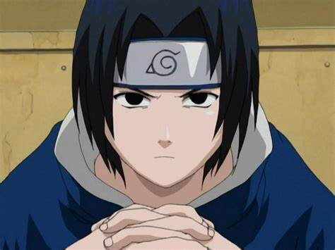

[Regresar a la página principal](../README.md)

# Sasuke Uchiha

Sasuke Uchiha es un personaje central en la serie "Naruto", creado por Masashi Kishimoto. Su arco de personaje es uno de los más complejos y emocionantes de la serie, pasando de ser un talentoso pero solitario joven a un poderoso shinobi que lucha con sus propios demonios internos y busca redención. A lo largo de la serie, Sasuke experimenta una profunda transformación influenciada por su búsqueda de poder, su conexión con su pasado y sus relaciones con otros personajes, especialmente Naruto Uzumaki.

## Índice de Contenidos

1. [Orígenes y Familia](#orígenes-y-familia).
    - [Trauma y Venganza](#trauma-y-venganza).
2. [Camino Ninja](#camino-ninja).
    - [Academia Ninja y Equipo 7](#academia-ninja-y-equipo-7).
    - [Exámenes Chūnin y Entrenamiento](#exámenes-chūnin-y-entrenamiento).
    - [Marca de Orochimaru y Renacimiento](#marca-de-orochimaru-y-renacimiento).
3. [Batallas y Conflictos](#batallas-y-conflictos).
    - [Encuentros con Itachi](#encuentros-con-itachi).
    - [Alianza con Akatsuki](#alianza-con-akatsuki).
    - [Batalla Final con Naruto](#batalla-final-con-naruto).
4. [Redención y Cambio](#redención-y-cambio).
5. [Legado y Significado](#legado-y-significado).

### Orígenes y Familia

Sasuke nació en el prestigioso Clan Uchiha de Konohagakure, una de las familias más poderosas y respetadas de la aldea. Sus padres fueron Fugaku Uchiha, el líder del clan, y Mikoto Uchiha. Tuvo una relación cercana con su hermano mayor, Itachi Uchiha, a quien admiraba profundamente. Sin embargo, su vida dio un giro trágico cuando Itachi, bajo órdenes de la aldea, masacró a todo el clan, dejando a Sasuke como el único superviviente.

#### Trauma y Venganza

La masacre de su clan dejó una profunda cicatriz en el corazón de Sasuke y lo impulsó a buscar venganza contra su hermano y contra Konoha. A lo largo de su adolescencia, Sasuke se obsesionó con la idea de matar a Itachi y restaurar el honor de su clan. Esta búsqueda de venganza lo llevó por un camino oscuro y peligroso, alejándolo de sus amigos y seres queridos.

[Regresar al inicio ☝🏻](#sasuke-uchiha)

### Camino Ninja

#### Academia Ninja y Equipo 7

Sasuke demostró ser un talentoso ninja desde una edad temprana y fue colocado en el Equipo 7 junto con Naruto Uzumaki, Sakura Haruno y bajo la tutela de Kakashi Hatake. A pesar de sus habilidades excepcionales, Sasuke luchó con sus propios demonios internos, sintiéndose constantemente presionado por el legado de su clan y la sombra de su hermano.

#### Exámenes Chūnin y Entrenamiento

Durante los Exámenes Chūnin, Sasuke fue testigo del poder de otros shinobi y se sintió frustrado por su propia falta de progreso. Este período de autodescubrimiento lo llevó a buscar formas de aumentar su fuerza, lo que lo llevó a buscar a Orochimaru, un sannin legendario y un peligroso criminal.

#### Marca de Orochimaru y Renacimiento

Sasuke fue marcado por Orochimaru como su recipiente elegido para su transferencia de cuerpo. Este acto marcó un punto de no retorno en el viaje de Sasuke hacia la oscuridad, llevándolo a abandonar Konoha en busca de poder y venganza. A lo largo de sus encuentros con Orochimaru y otros enemigos, Sasuke se sometió a un intenso entrenamiento y adquirió nuevas habilidades, pero también perdió parte de su humanidad en el proceso.

[Regresar al inicio ☝🏻](#sasuke-uchiha)

### Batallas y Conflictos

#### Encuentros con Itachi

El enfrentamiento entre Sasuke e Itachi fue uno de los arcos más emocionantes y complejos de la serie. A medida que Sasuke se acercaba a su objetivo de vengarse de su hermano, descubrió la verdad detrás de la masacre de su clan y el verdadero propósito de Itachi. Esta revelación sacudió los cimientos de la percepción de Sasuke y lo llevó a replantearse su búsqueda de venganza.

#### Alianza con Akatsuki

Después de la muerte de Itachi a manos de Sasuke, este último se unió a Akatsuki, una organización criminal que planeaba dominar el mundo ninja. Aunque inicialmente parecía que Sasuke estaba trabajando con Akatsuki por sus propios motivos, en realidad tenía planes más oscuros y complejos, incluida la destrucción de Konoha.

#### Batalla Final con Naruto

El clímax de la serie fue la batalla final entre Naruto y Sasuke en el Valle del Fin. Este enfrentamiento no solo fue una prueba de habilidades y poder, sino también un enfrentamiento de ideologías y emociones. Naruto, con su inquebrantable creencia en la amistad y la redención, luchó no solo para detener a Sasuke, sino también para salvarlo de sí mismo. La batalla terminó en un empate, pero marcó el comienzo de una nueva etapa en la relación de Naruto y Sasuke.

[Regresar al inicio ☝🏻](#sasuke-uchiha)

### Redención y Cambio

Aunque Sasuke había caído en la oscuridad, eventualmente llegó a comprender el valor de los lazos de amistad y la importancia de la redención. Después de su batalla con Naruto, Sasuke se embarcó en un viaje de autoaceptación y reconciliación con su pasado. Se redimió al ayudar a salvar al mundo ninja de amenazas como Kaguya Ōtsutsuki y finalmente regresó a Konoha, donde comenzó a reconstruir su vida y a reparar las relaciones rotas.

[Regresar al inicio ☝🏻](#sasuke-uchiha)

### Legado y Significado

El viaje de Sasuke es una historia de redención y cambio, un testimonio del poder del amor y la amistad para transformar incluso a los corazones más oscuros. A lo largo de la serie, Sasuke demuestra que, aunque puede haber caído en la oscuridad, siempre hay una oportunidad de volver a la luz y encontrar la redención. Su arco de personaje complejo y emocionante ha resonado con los fans de "Naruto" en todo el mundo, dejando un legado duradero en el corazón de la serie.

[Regresar al inicio ☝🏻](#sasuke-uchiha)