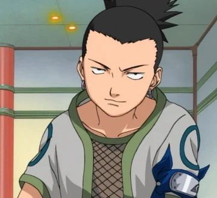

[Regresar a la página principal](../README.md)

# Shikamaru Nara

Shikamaru Nara es un personaje notable en la serie "Naruto", conocido por su inteligencia excepcional y su habilidad estratégica. Aunque inicialmente puede parecer perezoso o indiferente, Shikamaru es un genio táctico cuyas habilidades son ampliamente reconocidas en el mundo ninja.

## Índice de Contenidos

1. [Orígenes y Personalidad](#orígenes-y-personalidad).
2. [Habilidades y Técnicas](#habilidades-y-técnicas).
3. [Participación en Eventos Clave](#participación-en-eventos-clave).
4. [Relación con Asuma Sarutobi](#relación-con-asuma-sarutobi).
5. [Pérdida y Duelo](#pérdida-y-duelo).
6. [Relación con Naruto Uzumaki](#relación-con-naruto-uzumaki).
7. [Ascenso a Jonin y Más Allá](#ascenso-a-jonin-y-más-allá).
8. [Conclusión](#conclusión).

### Orígenes y Personalidad

#### Herencia del Clan Nara

Shikamaru Nara proviene del Clan Nara, conocido por su habilidad en el manejo de las sombras y las técnicas de control. Desde una edad temprana, Shikamaru mostró una aptitud natural para el análisis estratégico y la planificación, características distintivas de su linaje.

#### Personalidad Relajada

A primera vista, Shikamaru puede parecer perezoso o despreocupado, prefiriendo pasar su tiempo libre observando las nubes. Sin embargo, esta aparente indiferencia oculta su agudo intelecto y su capacidad para evaluar situaciones con rapidez y precisión.

[Regresar al inicio ☝🏻](#shikamaru-nara)

### Habilidades y Técnicas

#### Control de las Sombras

Al igual que otros miembros del Clan Nara, Shikamaru es capaz de manipular las sombras a su voluntad. Utiliza esta habilidad para atrapar y controlar a sus oponentes en combate, creando estrategias ingeniosas que aprovechan el entorno y las habilidades únicas de su clan.

#### Inteligencia Estratégica

La verdadera fuerza de Shikamaru radica en su inteligencia estratégica excepcional. Es capaz de analizar rápidamente las situaciones, identificar las debilidades del enemigo y formular planes elaborados para obtener la ventaja en el combate. Sus tácticas son tan efectivas que incluso los ninjas más poderosos reconocen su genialidad.

[Regresar al inicio ☝🏻](#shikamaru-nara)

### Participación en Eventos Clave

#### Exámenes Chūnin

Durante los Exámenes Chūnin, Shikamaru demostró su habilidad estratégica al liderar con éxito a su equipo a través de una serie de desafíos peligrosos. Aunque inicialmente reacio a asumir el papel de líder, Shikamaru demostró su valía al proteger a sus compañeros de equipo y superar obstáculos aparentemente insuperables.

#### Misión de Rescate de Sasuke

En la misión de rescate de Sasuke Uchiha, Shikamaru desempeñó un papel crucial al liderar un equipo de ninjas talentosos en una operación de alto riesgo. Su inteligencia estratégica y su capacidad para pensar con rapidez fueron fundamentales para el éxito de la misión, demostrando una vez más su valía como ninja de élite.

[Regresar al inicio ☝🏻](#shikamaru-nara)

#### Relación con Asuma Sarutobi

Asuma Sarutobi, un Jonin de la Aldea Oculta de la Hoja y amigo cercano de los padres de Shikamaru, actuó como mentor y figura paterna para él. La relación entre Shikamaru y Asuma fue profunda, con Asuma enseñándole no solo técnicas de combate, sino también lecciones sobre la vida y la responsabilidad.

[Regresar al inicio ☝🏻](#shikamaru-nara)

### Pérdida y Duelo

#### Muerte de Asuma

La pérdida más devastadora en la vida de Shikamaru fue la muerte de Asuma Sarutobi durante la batalla contra los miembros de Akatsuki. Asuma sacrificó su vida para proteger a Shikamaru y sus compañeros, dejando un vacío en el corazón de su alumno y un profundo sentido de pérdida en toda la aldea.

[Regresar al inicio ☝🏻](#shikamaru-nara)

#### Duelo Interno

La muerte de Asuma afectó profundamente a Shikamaru, quien se enfrentó a un duelo interno mientras luchaba por procesar su dolor y encontrar una manera de honrar el legado de su maestro. Este evento marcó un punto de inflexión en la vida de Shikamaru, inspirándolo a crecer y madurar tanto como ninja como persona.

[Regresar al inicio ☝🏻](#shikamaru-nara)

### Relación con Naruto Uzumaki

#### Compañeros de Equipo

Shikamaru y Naruto Uzumaki compartieron muchas experiencias como compañeros de equipo en misiones y batallas. Aunque inicialmente tenían personalidades diferentes, desarrollaron un respeto mutuo y una amistad duradera a lo largo de la serie, con Shikamaru admirando la determinación y el espíritu de lucha inquebrantable de Naruto.

[Regresar al inicio ☝🏻](#shikamaru-nara)

#### Apoyo y Compañerismo

Durante momentos difíciles, como la misión de rescate de Sasuke Uchiha, Shikamaru demostró su lealtad y apoyo a Naruto al trabajar juntos para superar desafíos y proteger a sus amigos. Su relación se basaba en la confianza mutua y el compañerismo, con cada uno apoyándose en momentos de necesidad.

[Regresar al inicio ☝🏻](#shikamaru-nara)

### Ascenso a Jonin y Más Allá

#### Promoción a Jonin

Después de demostrar su valía en numerosas misiones y batallas, Shikamaru fue promovido a Jonin, un rango reservado para ninjas de élite y expertos en su campo. Como Jonin, Shikamaru asumió roles de liderazgo más prominentes y se convirtió en un mentor para la próxima generación de ninjas de la aldea.

#### Consejero del Hokage

En el período posterior a la Cuarta Guerra Mundial Ninja, Shikamaru se convirtió en consejero del Hokage, desempeñando un papel importante en la administración y la toma de decisiones de la aldea. Su agudo intelecto y su perspicacia estratégica lo convirtieron en un activo invaluable para el liderazgo de la aldea.

[Regresar al inicio ☝🏻](#shikamaru-nara)

### Conclusión

Shikamaru Nara es un personaje destacado en la serie "Naruto", conocido por su inteligencia excepcional y su habilidad estratégica. Desde sus humildes comienzos como un genin aparentemente perezoso hasta su ascenso a Jonin y su papel como consejero del Hokage, Shikamaru ha demostrado ser un ninja de élite cuyas habilidades son ampliamente reconocidas en el mundo ninja. Su relación con su maestro, su pérdida personal y su conexión con Naruto Uzumaki agregan profundidad a su personaje y lo convierten en un personaje querido y memorable en la serie.

[Regresar al inicio ☝🏻](#shikamaru-nara)
