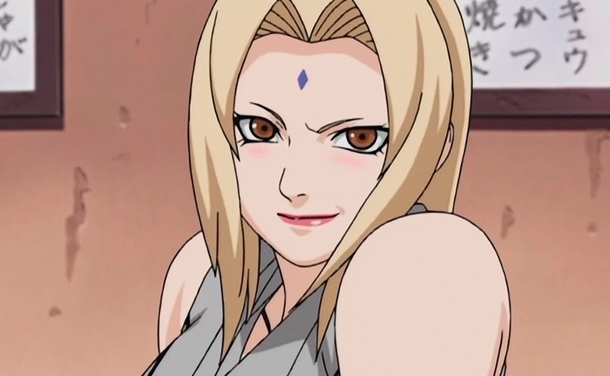

[Regresar a la página principal](../README.md)

# Tsunade

Tsunade es una figura emblemática en el mundo de "Naruto", cuya historia está marcada por una rica herencia familiar, habilidades excepcionales, y una notable participación en los eventos clave de la serie. 

## Índice de Contenidos

1. [Orígenes y Legado Familiar](#orígenes-y-legado-familiar).
    - [Descendiente de los Senju](#descendiente-de-los-senju).
    - [La Pérdida de Seres Queridos](#la-pérdida-de-seres-queridos).
2. [Habilidades y Contribuciones](#habilidades-y-contribuciones).
    - [Maestría en el Ninjutsu Médico](#maestría-en-el-ninjutsu-médico).
    - [Fuerza Sobrehumana](#fuerza-sobrehumana).
3. [Participación en la Historia](#participación-en-la-historia).
    - [Segunda Guerra Mundial Ninja](#segunda-guerra-mundial-ninja).
    - [Batalla contra Orochimaru](#batalla-contra-orochimaru).
    - [Ascenso a Quinta Hokage](#ascenso-a-quinta-hokage).
    - [Invasión de Pain](#invasión-de-pain).
    - [Cuarta Guerra Ninja](#cuarta-guerra-ninja).
    - [Legado Duradero](#legado-duradero).
4. [Relaciones Significativas](#relaciones-significativas).
    - [Vínculo con Jiraiya](#vínculo-con-jiraiya).
    - [Mentoría a Sakura](#mentoría-a-sakura).
    - [Relación con Naruto](#relación-con-naruto).
5. [Mayores Hazañas](#mayores-hazañas).
    - [Creación de la Técnica de la Reencarnación: Renacimiento del Alma](#creación-de-la-técnica-de-la-reencarnación-renacimiento-del-alma).
    - [Protección de la Aldea](#protección-de-la-aldea).
    - [Inspiración para las Generaciones Futuras](#inspiración-para-las-generaciones-futuras).
6. [Conclusión](#conclusión).

### Herencia y Legado Familiar

#### Descendiente de los Senju

Tsunade pertenece al prestigioso Clan Senju, una de las familias más influyentes y poderosas en la historia de las aldeas ninjas. Esta herencia le otorga un linaje noble y un legado de habilidades extraordinarias en el uso del chakra y el manejo del ninjutsu médico. Además, es nieta del Primer Hokage, Hashirama Senju.

#### La Pérdida de Seres Queridos

A lo largo de su vida, Tsunade ha experimentado pérdidas devastadoras, incluida la muerte de su hermano Nawaki y su amado, Dan Kato, durante la Segunda Guerra Mundial Ninja. Estas tragedias la han marcado profundamente, influyendo en sus decisiones y perspectivas futuras.

[Regresar al inicio ☝🏻](#tsunade)

### Habilidades y Contribuciones

#### Maestría en el Ninjutsu Médico

Tsunade es famosa por su excepcional habilidad en el ninjutsu médico, una forma avanzada de ninjutsu que utiliza chakra para curar heridas y enfermedades. Su destreza en este arte es legendaria, y ha salvado innumerables vidas a lo largo de los años, ganándose el respeto y la admiración de sus compañeros.

#### Fuerza Sobrehumana

Además de sus habilidades médicas, Tsunade posee una fuerza física extraordinaria, que la convierte en una fuerza imparable en el campo de batalla. Su capacidad para partir montañas y nivelar campos de batalla con un solo golpe la ha convertido en una leyenda viva entre los ninjas.

[Regresar al inicio ☝🏻](#tsunade)

### Participación en la Historia

#### Segunda Guerra Mundial Ninja

Durante la Segunda Guerra Mundial Ninja, Tsunade luchó valientemente como una de las kunoichi más destacadas de la Aldea Oculta de la Hoja. Su destreza en el combate y su dominio del ninjutsu médico fueron fundamentales para mantener a salvo a su equipo y apoyar a las fuerzas aliadas en la batalla.

#### Batalla contra Orochimaru

Uno de los enfrentamientos más destacados de Tsunade fue su batalla contra Orochimaru, su antiguo compañero de equipo y enemigo jurado. En este enfrentamiento épico, Tsunade demostró su fuerza y habilidad al enfrentarse a Orochimaru y proteger a la aldea de sus malévolos planes.

#### Ascenso a Quinta Hokage

Después de la muerte de Hiruzen Sarutobi, Tsunade fue elegida como la Quinta Hokage de la Aldea Oculta de la Hoja. Su nombramiento marcó un nuevo capítulo en la historia de la aldea, con Tsunade asumiendo el liderazgo y defendiendo a la aldea de numerosas amenazas, incluidas las organizaciones criminales y los invasores extranjeros.

#### Invasión de Pain

Durante la Invasión de Pain, Tsunade demostró su valentía y liderazgo al enfrentarse a los seis cuerpos de Pain, que habían lanzado un devastador ataque contra la aldea. A pesar de estar gravemente herida en la batalla, Tsunade mantuvo la calma y luchó con todas sus fuerzas para proteger a su pueblo.

#### Cuarta Guerra Ninja

En la Cuarta Guerra Ninja, Tsunade desempeñó un papel fundamental como comandante en jefe de las fuerzas aliadas. Su experiencia y habilidades estratégicas fueron vitales para coordinar los esfuerzos de las diferentes aldeas y liderarlas en la batalla contra la Alianza Shinobi. Aunque enfrentó numerosos desafíos y peligros, Tsunade nunca vaciló en su determinación de proteger a sus compañeros ninja y derrotar a sus enemigos.

#### Legado Duradero

El legado de Tsunade como Hokage perdura mucho después de su mandato, siendo recordada como una de las líderes más respetadas y queridas en la historia de la aldea. Su enfoque en la protección de la vida y la promoción de la paz la convierte en un ejemplo a seguir para futuras generaciones de ninja.

[Regresar al inicio ☝🏻](#tsunade)

### Relaciones Significativas

#### Vínculo con Jiraiya

Tsunade compartió una relación especial con Jiraiya, uno de los legendarios Sannin y compañero de equipo de su juventud. Aunque su relación tuvo altibajos, Tsunade y Jiraiya compartían un profundo respeto y afecto mutuo, con Jiraiya actuando como un mentor y protector para Tsunade en momentos de necesidad.

#### Mentoría a Sakura

Tsunade también actuó como mentora para Sakura Haruno, transmitiéndole sus conocimientos en el ninjutsu médico y guiándola en su camino como ninja. Su relación con Sakura fue fundamental para el crecimiento y desarrollo de la joven ninja, enseñándole lecciones valiosas sobre fuerza, determinación y compasión.

#### Relación con Naruto

Tsunade desarrolló una relación especial con Naruto Uzumaki, a quien consideraba un sucesor digno de su título como Hokage. A lo largo de la serie, ofreció orientación y apoyo a Naruto, reconociendo su potencial y creyendo en su capacidad para cambiar el mundo ninja para mejor.

[Regresar al inicio ☝🏻](#tsunade)

### Mayores Hazañas

#### Creación de la Técnica de la Reencarnación: Renacimiento del Alma

Una de las mayores hazañas de Tsunade fue la creación de la Técnica de la Reencarnación: Renacimiento del Alma, una técnica médica avanzada que le permitió curar lesiones y enfermedades mortales que de otro modo serían incurables. Esta técnica revolucionaria salvó innumerables vidas y le valió el reconocimiento como una de las mejores médicas de la historia.

#### Protección de la Aldea

Como Quinta Hokage, Tsunade dedicó su vida a proteger la Aldea Oculta de la Hoja y a sus habitantes. Su liderazgo firme y su valentía inquebrantable fueron fundamentales para mantener la paz y la estabilidad en la aldea, defendiéndola de amenazas tanto internas como externas.

#### Inspiración para las Generaciones Futuras

El legado de Tsunade perdura mucho después de su mandato como Hokage, siendo recordada como una líder excepcional y una sanadora compasiva. Su ejemplo continúa inspirando a las generaciones futuras de ninja, instándolos a seguir sus pasos y a luchar por un mundo de paz y prosperidad.

[Regresar al inicio ☝🏻](#tsunade)

### Conclusión

Tsunade es una figura impresionante en el universo de "Naruto", cuya historia está marcada por una rica herencia familiar, habilidades excepcionales y una notable participación en los eventos clave de la serie. Su relación con Jiraiya y Naruto, así como su papel como mentora para Sakura, agregan profundidad a su personaje y destacan su importancia como líder, sanadora y modelo a seguir en el mundo ninja. Su legado perdurará como una inspiración para las generaciones futuras de ninja.

[Regresar al inicio ☝🏻](#tsunade)

